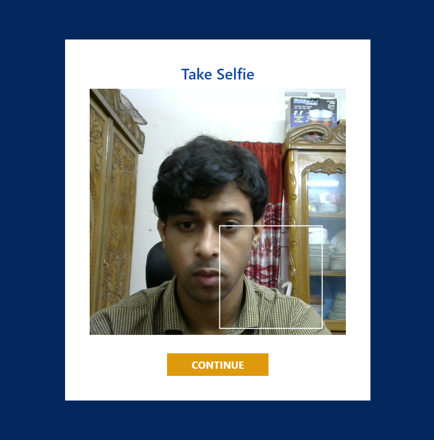
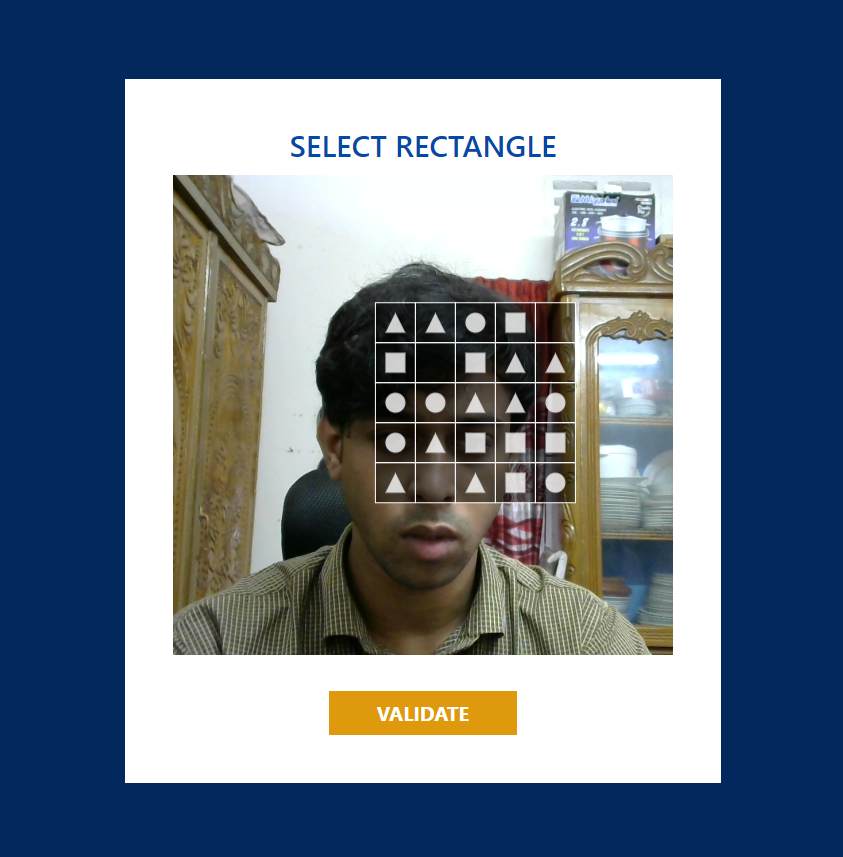
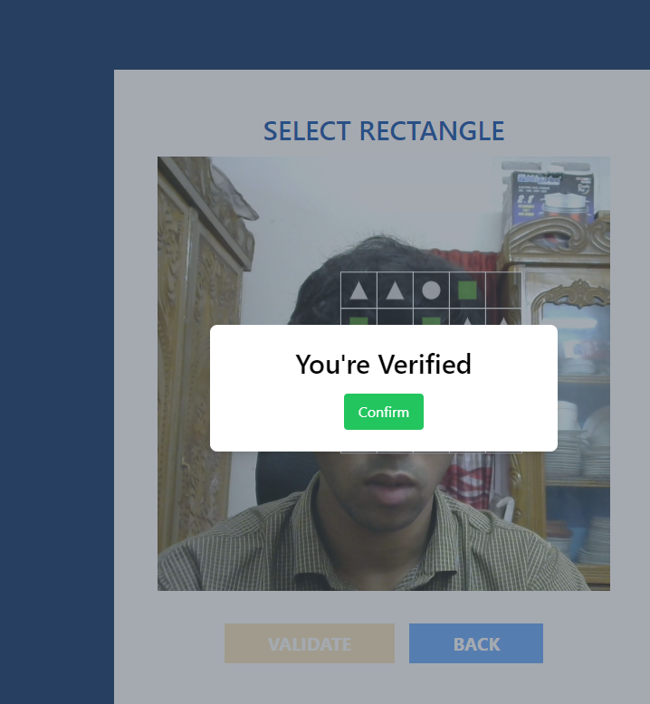
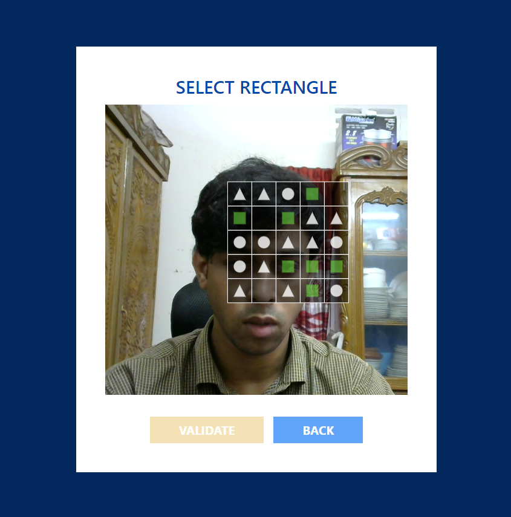

# Captcha Code Challange

## Table of Contents

- [Preview](#preview)
- [Technologies](#technologies)
- [Installation](#installation)
- [Features](#features)

### Preview









#### Live Demonstration

[Captcha Code Challange](https://captcha-l.vercel.app/)

### Technologies

- TypeScript, React, Vite, FabricJS, Zustand, react-router-dom, Tailwind

### Installation

```bash

git clone https://github.com/enam-0042/Captcha.git
cd Captcha
npm install
npm run dev
```

### Features

#### Video Stream from Selfie Camera

The user is presented with a video stream from their selfie camera.

#### Dynamic Square-Shaped Area

A square-shaped area within the video stream that moves randomly.

#### Image Capture and Division

After clicking "Continue," the captured image shows the locked captcha area divided into squares by horizontal and vertical lines.

#### Watermarks in the Square

- Half of the sectors in the square contain watermarks (randomly selected).
- Watermarks are one of three shapes: triangle, rectangle, or circle.

#### Validate Button

- Allows the user to submit their selection for validation.

- The user is informed whether they passed the CAPTCHA test or not.

#### Anti-Automation Measures

The CAPTCHA puzzle should be designed to prevent computerized tools from resolving it (to distinguish humans from bots).

### License

Distributed under the MIT License. See LICENSE for more information.
